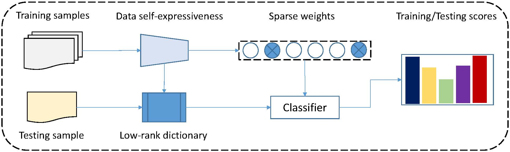

# Low-rank and sparse representation based learning for cancer survivability prediction

This project hosts the codes for the paper: 

> [**Low-rank and sparse representation based learning for cancer survivability prediction**]
> Jie Yang, Jun Ma, Khin Than Win, Junbin Gao, Zhenyu Yang
> Accepted by Information Science

## Abstract
Cancer survivability prediction has been of great interest to health professionals and researchers. The task refers to the procedure of estimating the potential survivability according to an individual's medical history. The difficulty is that raw data is usually subject to some noise, such as missing values. To address this issue, we propose a novel low-rank and sparse representation-based learning algorithm, which consists of two main stages of data self expressiveness and classification. Firstly, in the data self expressiveness stage, raw inputs have been decomposed into one dictionary (which is enforced with a low-rank constraint) and one coefficient matrix (which is sparsely coded), respectively. Secondly, this sparse coefficient matrix is paired with sample labels for training during the classification stage. We further integrate these two stages and formulate them into an optimization problem, which is then solved using an iterative computational strategy. Theoretically, we analyze the convergence of the proposed algorithm. The connection and difference between the proposed algorithm and existing approaches are also discussed. The efficiency of the proposed algorithm is experimentally verified using several benchmarking classification problems and a public longitudinal dataset. Experimental results demonstrate that the proposed algorithm achieves superior performance in terms of affordable computational complexity and high prediction accuracy, compared to state-of-the-art approaches.

## Algorithm

## Dataset
   - This project is mainly based on the open-source SEER data (https://seer.cancer.gov/).

   - Please refer to the [FileDescription.pdf](https://seer.cancer.gov/data-software/documentation/seerstat/nov2015/TextData.FileDescription.pdf) for more descriptoin about the installation and dataset preparation.

   - We also employ a few benchmarking problems from the [UCI](https://archive.ics.uci.edu/ml/datasets.php) repository, including Hepatitis, Liver, Blood, Mammographic, Loan, Tae, Cleveland, CMC, Wine, and Abalone.

## Result

### List of selected variables/features from SEER for prediction modelin

Feature | Description | Unique Values
--- |:---:|:---:
REG |	Registry ID | 8 	
MAR\_STAT | Marital status at diagnosis | 6 
RACE  |	Ethnicity  | 29	
ORIGIN  | Spanish/Hispanic Origin | 10 
SEX  |	Gender  | 2	
YR\_BRTH |	Year of birth  | 111 
DATE\_YR |	Year of diagnosis | 40
SEQ\_NUM | Sequence of all reportable malignant  | 2
SITEO2V | Primary site | 9
LATERAL |	Laterality 	| 5
SURGPRIM | Surgery of primary site | 7
NO\_SURG |	Reason no cancer-directed surgery  	| 8
RADIATN | Method of radiation therapy | 10
RAD\_SURG |	Radiation sequence with surgery | 7
NUMPRIMS | Number of primaries | 6
HISTREC | Histology | 7
ERSTATUS |	Tumor marker 1  | 5
PRSTATUS | Tumor marker 2 | 5
ADJTM\_6 |	Breast Adjusted AJCC 6th T | 16 
ADJNM\_6 | Breast Adjusted  AJCC 6th N  | 7
ADJM\_6 |	Breast Adjusted  AJCC 6th M  | 5
ADJAJCCSTG | Breast Adjusted  AJCC 6th Stage  | 12
SRV\_TIME\_MON | Survival Months (dependent variable) | 447 

### Comparison with Existing Methods

Algorithm | Train | Testing
--- |:---:|:---:
SRC| -| 69.60%| 
LC-KSVD| 83.77%| 70.75%| 
ISSRC| -| 68.06%| 
IRPCA| 81.82%| 61.57%| 
ROSL| 82.47%| 78.99%| 
LRVD-IPGSR| -| 63.45%| 
Proposed| 84.20%| 81.41%| 

